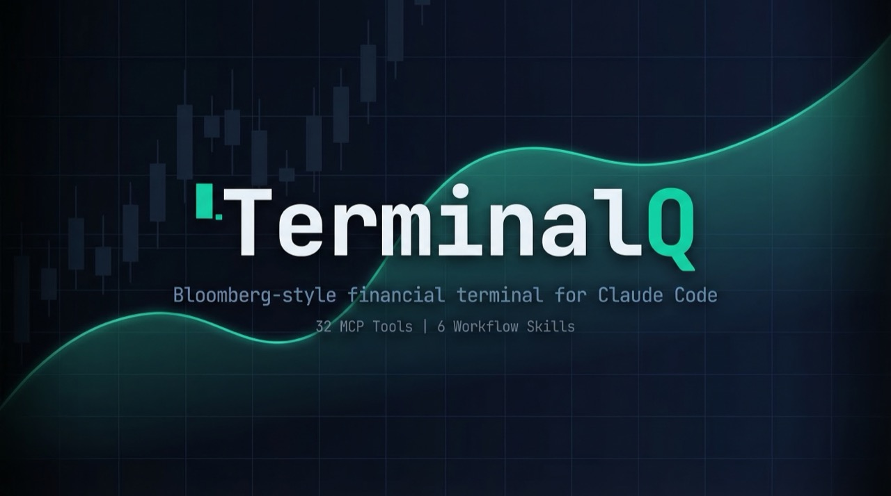

<p align="center">
  
</p>

<p align="center">
  <strong>Professional-grade portfolio intelligence, market analysis, and investment research — delivered through conversation.</strong>
</p>

<p align="center">
  <a href="#installation">Installation</a> &bull;
  <a href="#why-terminalq">Why TerminalQ</a> &bull;
  <a href="#workflow-skills">Workflow Skills</a> &bull;
  <a href="#mcp-tools">MCP Tools</a> &bull;
  <a href="#slash-commands">Slash Commands</a> &bull;
  <a href="#data-providers">Data Providers</a> &bull;
  <a href="#architecture">Architecture</a>
</p>

---

## Why TerminalQ

Individual investors face a fundamental problem: the tools that power institutional decision-making — real-time market data, portfolio analytics, macro indicators, technical analysis — are locked behind $24,000/year Bloomberg terminals or scattered across dozens of websites and apps.

TerminalQ closes that gap. It turns Claude into a financial analyst that can:

- **Pull live quotes, financials, and earnings** from the same data sources professionals use
- **Analyze your actual portfolio** with risk metrics, allocation breakdowns, and concentration warnings
- **Run multi-step research workflows** — morning market briefings, company deep-dives, trade decision briefs — that would take 30+ minutes of manual research
- **Track macro conditions** — yield curves, inflation, labor market, Fed policy — and connect them to your holdings
- **Generate charts** — price action, sector heatmaps, allocation breakdowns, yield curves — right in your terminal

All of this happens in a natural conversation. No switching tabs. No copy-pasting data. No spreadsheets. Just ask Claude what you want to know about the markets or your portfolio, and TerminalQ provides the data to back it up.

**Your portfolio data stays on your machine.** Holdings, RSU schedules, and account data live in `~/.terminalq/` — they're never sent to external APIs or stored in the cloud.

---

## Installation

### Prerequisites

- [Claude Code](https://docs.anthropic.com/en/docs/claude-code) CLI installed
- [uv](https://docs.astral.sh/uv/) (Python package manager)
- Python 3.11+

### Quick Start

```bash
# Clone the repo
git clone https://github.com/fakoli/terminalq.git
cd terminalq

# Run setup (installs deps, creates ~/.terminalq/, checks API keys)
./setup.sh

# Install as a Claude Code plugin
claude plugin install .
```

### API Keys

Add your API keys to `~/.env`:

```bash
FINNHUB_API_KEY="your_finnhub_key"    # Required — https://finnhub.io/register
FRED_API_KEY="your_fred_key"          # Required — https://fred.stlouisfed.org/docs/api/api_key.html
BRAVE_API_KEY="your_brave_key"        # Optional — https://brave.com/search/api/
```

| Provider | Required | Free Tier | What It Powers |
|----------|----------|-----------|---------------|
| [Finnhub](https://finnhub.io/register) | Yes | 60 calls/min | Quotes, profiles, news, earnings, analyst ratings |
| [FRED](https://fred.stlouisfed.org/docs/api/api_key.html) | Yes | 120 calls/min | Economic indicators, yield curve, forex |
| [Brave Search](https://brave.com/search/api/) | No | 2,000 calls/mo | Web search for research |
| SEC EDGAR | No key needed | 10 req/sec | Financial statements, SEC filings |
| Yahoo Finance | No key needed | Via yfinance | Historical prices, dividends |
| CoinGecko | No key needed | 30 calls/min | Cryptocurrency data |

### Import Your Portfolio

```bash
# Option 1: Use the interactive ingestion command
/ingest holdings

# Option 2: Edit the template directly
nano ~/.terminalq/portfolio-holdings.md
```

TerminalQ reads portfolio data from markdown tables in `~/.terminalq/`. Templates are created during setup. The `/ingest` command can parse brokerage statements, CSVs, or pasted text.

---

## Workflow Skills

TerminalQ includes 6 workflow skills that orchestrate multiple tools into comprehensive financial analyses. Each produces structured output following [output contracts](docs/output-contracts.md) with data freshness tracking and disclaimers.

### `/market-overview` — Morning Market Briefing

> "How are markets doing?" / "Morning briefing" / "What happened in markets?"

Pulls index quotes, sector performance, macro indicators, economic calendar, and your portfolio in parallel. Produces a briefing covering market mood, index snapshot, style rotation, sector heatmap, macro dashboard, upcoming catalysts, and portfolio impact.

### `/company-research SYMBOL` — Deep-Dive Research Report

> "Research AAPL" / "Deep dive into NVDA" / "Due diligence on MSFT"

Runs 11 tools in parallel: company profile, quote, 3 financial statements, technicals, analyst ratings, news, earnings, price chart, and allocation. Produces a report with financial health, valuation, technical picture, bull/bear cases, analyst consensus, and portfolio fit.

### `/portfolio-health` — Portfolio Health Check

> "How is my portfolio?" / "Am I diversified?" / "Portfolio review"

Gathers live holdings, risk metrics (Sharpe, Sortino, VaR, beta), allocation breakdown, and RSU schedule. Produces a scorecard with risk assessment, concentration warnings, benchmark comparison, and actionable rebalancing suggestions.

### `/trade-research SYMBOL` — Investment Decision Support

> "Should I buy AAPL?" / "Evaluate NVDA" / "Trade idea for AMZN"

Two-round analysis: first gathers company data (10 tools), then portfolio context (allocation + risk baseline). Produces a decision brief with investment thesis, valuation, technical entry point, portfolio fit, position sizing, risk management, and a BUY / WAIT / AVOID recommendation.

### `/economic-outlook` — Macro Economic Analysis

> "Economic outlook" / "Recession risk?" / "Fed watch"

Pulls macro dashboard, economic calendar, yield curve, forex rates, and asset class proxies. Produces an economic brief covering business cycle positioning, inflation, labor market, Fed policy outlook, and portfolio implications.

### `/earnings-preview` — Earnings Season Prep

> "Upcoming earnings" / "Who reports this week?" / "Prep for earnings"

Identifies portfolio holdings with upcoming earnings, then pulls EPS history, analyst ratings, technicals, and news for each. Produces a calendar, per-company analysis, portfolio risk summary, and action items.

---

## MCP Tools

TerminalQ exposes 32 MCP tools organized into five categories:

### Quotes & Market Data
| Tool | Description |
|------|-------------|
| `terminalq_get_quote` | Real-time stock/ETF quote |
| `terminalq_get_quotes_batch` | Parallel batch quotes |
| `terminalq_get_historical` | OHLCV price data (1d/1wk/1mo intervals) |
| `terminalq_get_dividends` | Dividend history + yield |
| `terminalq_get_economic_calendar` | Upcoming economic events |

### Portfolio & Analytics
| Tool | Description |
|------|-------------|
| `terminalq_get_portfolio` | Static holdings from brokerage data |
| `terminalq_get_portfolio_live` | Holdings with live prices + daily P&L |
| `terminalq_get_rsu_schedule` | RSU vesting schedule |
| `terminalq_get_watchlist` | Watchlist with live quotes |
| `terminalq_get_risk_metrics` | Sharpe, Sortino, VaR, beta, max drawdown |
| `terminalq_get_allocation` | Asset class breakdown + concentration risk |

### Research & Fundamentals
| Tool | Description |
|------|-------------|
| `terminalq_get_company_profile` | Company overview, sector, market cap |
| `terminalq_get_news` | Company news articles |
| `terminalq_get_earnings` | EPS history + estimates |
| `terminalq_get_analyst_ratings` | Buy/Hold/Sell consensus + price targets |
| `terminalq_get_financials` | SEC financial statements (income, balance sheet, cash flow) |
| `terminalq_get_filings` | SEC filing search (10-K, 10-Q, 8-K) |
| `terminalq_get_technicals` | SMA, EMA, RSI, MACD, Bollinger Bands, ATR |
| `terminalq_screen_stocks` | S&P 500 screener by sector + market cap |
| `terminalq_web_search` | Web search for financial research |

### Charts & Visualization
| Tool | Description |
|------|-------------|
| `terminalq_chart_price` | Line or candlestick price chart |
| `terminalq_chart_comparison` | Multi-symbol % return overlay |
| `terminalq_chart_allocation` | Portfolio allocation bar chart |
| `terminalq_chart_yield_curve` | US Treasury yield curve |
| `terminalq_chart_sector_heatmap` | S&P 500 sector performance heatmap |

### Economics & Crypto
| Tool | Description |
|------|-------------|
| `terminalq_get_economic_indicator` | FRED data (GDP, CPI, unemployment, etc.) |
| `terminalq_get_macro_dashboard` | 11 key economic indicators at a glance |
| `terminalq_get_forex` | Currency exchange rates |
| `terminalq_get_crypto` | Cryptocurrency quote |
| `terminalq_get_crypto_batch` | Batch crypto quotes |

### Audit & Usage
| Tool | Description |
|------|-------------|
| `terminalq_get_audit_log` | Tool invocation history with timing + sources |
| `terminalq_get_usage_stats` | Daily/monthly usage and API budget tracking |

---

## Slash Commands

26 slash commands for quick access to any tool:

| Command | Description |
|---------|-------------|
| `/quote AAPL` | Real-time quote with portfolio context |
| `/portfolio` | All holdings with live prices, grouped by account |
| `/news AAPL` | News for a ticker or top portfolio holdings |
| `/earnings AAPL` | Earnings history, beat rate, EPS trend |
| `/financials AAPL` | SEC financial statements |
| `/technicals AAPL` | Technical analysis report |
| `/ratings AAPL` | Analyst ratings + price targets |
| `/chart AAPL 1y` | Price chart (line or candlestick) |
| `/compare AAPL,MSFT,GOOGL` | Multi-symbol performance comparison |
| `/historical AAPL 6mo` | Historical price data |
| `/dividends VTI` | Dividend history and yield |
| `/filings AAPL 10-K` | SEC filing search |
| `/screen Technology` | S&P 500 stock screener |
| `/economy` | Full macro dashboard |
| `/yield-curve` | US Treasury yield curve |
| `/forex` | Major currency pairs |
| `/crypto BTC` | Cryptocurrency prices |
| `/risk` | Portfolio risk metrics |
| `/allocation` | Portfolio allocation visualization |
| `/rsu` | RSU vesting schedule |
| `/watchlist` | Watchlist with live quotes |
| `/events` | Upcoming economic events |
| `/search "AAPL earnings"` | Web search for research |
| `/ingest holdings` | Import brokerage data |
| `/audit` | Tool invocation history |
| `/usage` | API usage and budget tracking |

---

## Data Providers

TerminalQ aggregates data from 8 providers with automatic caching, rate limiting, and fallback:

```
                    +-----------+
                    | Claude    |
                    | Code      |
                    +-----+-----+
                          |
                    +-----+-----+
                    | TerminalQ |
                    | MCP Server|
                    +-----+-----+
                          |
         +--------+-------+-------+--------+
         |        |       |       |        |
    +----+---+ +--+--+ +--+--+ +-+----+ +-+------+
    |Finnhub | |FRED | |EDGAR| |yfinance| |CoinGecko|
    |quotes  | |macro| |SEC  | |OHLCV  | |crypto  |
    |news    | |forex| |10-K | |divs   | +--------+
    |ratings | |yield| |XBRL | +-------+
    |earnings| +-----+ +-----+          +-+------+
    +--------+                          |Brave   |
         |                              |Search  |
    +----+---+                          +--------+
    |Polygon |
    |fallback|
    +--------+
```

All providers follow the same pattern:
- Return `{"error": "...", "source": "provider"}` on failure — never raise exceptions
- Cache responses with configurable TTLs (60s for quotes, 24h for fundamentals)
- Respect rate limits via token-bucket rate limiter
- Log all invocations to an audit trail

---

## Architecture

```
terminalq/
  .claude-plugin/
    plugin.json                 # Plugin manifest
  src/terminalq/
    server.py                   # FastMCP server — 32 tools
    config.py                   # API keys, cache TTLs, rate limits
    cache.py                    # File-based cache with TTL
    audit.py                    # Audit trail + arg sanitization
    usage_tracker.py            # Monthly budgets + daily counters
    rate_limiter.py             # Token-bucket rate limiter
    charts.py                   # Terminal charts (line, candle, heatmap)
    providers/
      finnhub.py                # Quotes, profiles, news, earnings, ratings
      fred.py                   # Economic indicators, macro dashboard, forex
      edgar.py                  # SEC filings + XBRL financials
      historical.py             # yfinance + Polygon.io fallback
      polygon.py                # Polygon.io fallback provider
      technical.py              # Computed indicators (SMA, RSI, MACD, etc.)
      screener.py               # S&P 500 stock screener
      coingecko.py              # Cryptocurrency prices
      search.py                 # Brave web search
      portfolio.py              # Local portfolio/watchlist parser
    analytics/
      risk.py                   # Sharpe, Sortino, VaR, beta, drawdown
      allocation.py             # Asset class breakdown, concentration
  skills/                       # 6 workflow skills (market, research, trade, etc.)
  commands/                     # 26 slash commands
  hooks/                        # SessionStart + Stop quality gate
  tests/                        # 267 tests (unit + contract)
  docs/                         # Output contracts, API reference
```

### Key Design Decisions

- **MCP over REST**: Runs as a stdio MCP server — Claude Code manages the lifecycle, no ports or auth needed
- **Privacy-first**: Portfolio data lives in `~/.terminalq/`, outside the repo, never sent to external APIs
- **Graceful degradation**: Every skill has a failure modes table; if a data source fails, the output notes what's missing instead of crashing
- **Output contracts**: All skills produce standardized output with required sections, data freshness tables, and disclaimers
- **Audit trail**: Every tool call is logged with args, timing, data sources, and payload size for compliance and debugging

---

## Testing

```bash
# Run all tests (267 tests)
uv run pytest tests/ -v

# Run just contract tests (structural validation for skills, commands, plugin layout)
uv run pytest tests/contracts/ -v

# Run with coverage
uv run pytest tests/ --cov=terminalq --cov-report=term-missing
```

Contract tests verify that every skill has frontmatter, tool references, numbered steps, output contract references, failure modes, and "when not to use" guidance.

---

## Contributing

1. Fork the repo
2. Create a feature branch (`git checkout -b feat/my-feature`)
3. Run tests (`uv run pytest tests/ -v`)
4. Push and open a PR — CI will run all tests automatically

### Adding a New Provider

1. Create `src/terminalq/providers/your_provider.py`
2. Follow the error convention: return `{"error": "...", "source": "your_provider"}`, never raise
3. Add cache TTL and rate limit constants to `config.py`
4. Register tools in `server.py` with `@mcp.tool()` and `@audited`
5. Add tests in `tests/test_your_provider.py`

### Adding a New Skill

1. Create `skills/your-skill/SKILL.md` with frontmatter (name, description 250+ chars)
2. Include: numbered steps, tool references, output contract reference, failure modes table, "when not to use"
3. Contract tests will enforce the structure automatically

---

## License

MIT

---

<p align="center">
  <sub>TerminalQ is for informational and educational purposes only — not financial advice. Always do your own due diligence.</sub>
</p>
